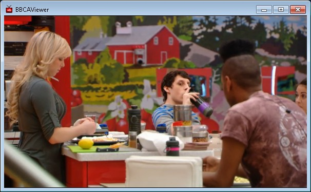

Big Brother CANADA Viewer 1.07
======

Quad Cam
	- added Quad Cam (Cam 5)
	- I recommend sticking to lower quality - for bandwidth and/or cpu purposes
	- Pause, Mute and Volume controls all four cameras
	- Cameras aren't "synced", they play as soon as they are able to.
		- Audio will be annoying since they aren't sync'ed
		- Individual cameras may pause if they are buffering, causing further "unsyncedness" :P
		- You can use the |> (Go Live) button to "reset" them all
		- You should try a lower quality if this is happening frequently (you might not have enough bandwidth or cpu power to keep up with all four at higher quality)
	- Quad cam does not check the video urls first, so you may see one or more blank cameras if those cameras are not available
	- Quad cam is not remembered as the last camera used - this is intentional.
Chat
	- FYI: you are entering #jokerschat - JokersUpdates IRC channel - just so you know :)
	- This chat is NOT BBCAViewer support, please contact me via PM on JokersUpdates (liquid8d) or email (liquid8d@gmail.com) if you need help with the viewer
	- You now must input a name using the "/nick yourname" command before you can enter #jokerschat
		- If you have already set your username, this should not affect you
Media Status
	- Media status is shown in title bar (Paused, Buffering, Error, etc)
Built with Air 2.5 SDK
	- This should allow Linux users to use it if Air 2.6 is installed
    
    NOTE: This release should have much better handling of finding the feeds. It will let you know if a specific cam and quality is not available.

AUTO-UPDATERS: Select 'Download', then 'Postpone until restart', close app, then reopen it!

Big Brother CANADA Viewer 1.06
===========
- Feed loading improvements
- Should be a big improvement, I verify links are valid before trying to use them
- It doesn't mean a specific cam/quality will always work (sometimes there is no valid link)
- If a particular cam and quality is not available, you will see a message in the window title
- Video will stop when selecting a new cam or quality

- Saves last used camera and quality

- Chat Improvements
- Basic Join/Notice/Kick messages added to chat
- Larger chat font size (for now, looking into letting you adjust later) 

Read more: http://forums.jokersupdates.com/ubbthreads/showthreaded.php?Board=BBCAHelp&Number=19113801#ixzz32doavmnz