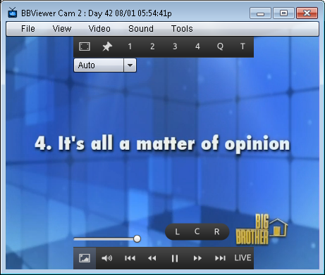

BBViewer 2.4
============

Here is the latest version 2.4 release. There is now two versions - one specific for Windows users that has screenshot capabilities, and the other that will work on any platform, but does not have screenshot capabilities

What's New:

Screenshots (Native Windows app ONLY)
- Screenshots are stored in your Documents/bbviewer folder
- Screenshots will only be as big as the window is

New Video menu with different aspects (4x3, 4x3 Cropped (def), Stretched)
4x3 cropped is now default - "crops off" the black bars as long as window is sized properly
4x3 scales the direct video feed, which contains black bars on the sides
Stretched will fill the window completely with no black borders, but will stretch the image
Window sizes (small, med, large) are now fixed sizes, not screen percentages
Because of this, sizes will likely seem different to you now, based on your screen resolution
New buttons for panning audio (Left, Center, Right) when mousing over sound icon
New hotkeys for Long Skip: , (comma - Skip Back Long) and . (period for Skip Forward Long)
Alliance chart added in Tools (courtesy of Butterbean13!)
Quality is placed under top bar, so they don't overlap
Bookmarks can now be sorted in date order correctly (i think)
Bookmark list is a little bigger
Changed Logout of CBS in menu to CBS Login
Notification Message (for screenshots or possible errors)
